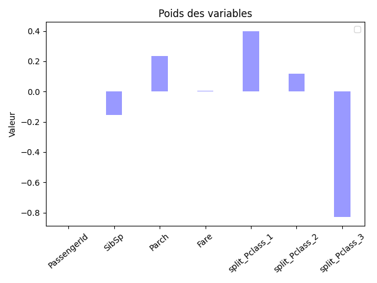
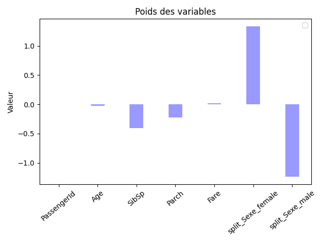
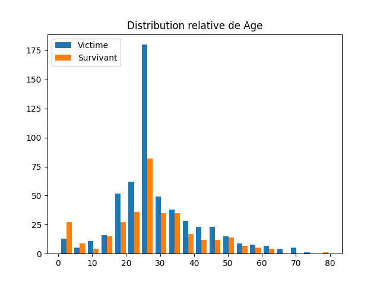
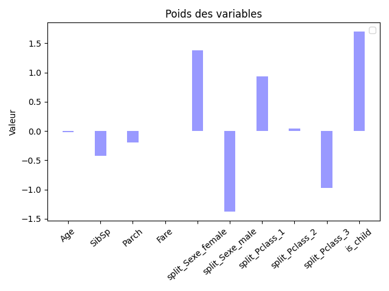

# Réponse TP2
## HEBAN Simon

### 1 les données

#### Question 3

- Survived : La personne à t'elle survécu type booléen (0=non;1=oui)
- PClass : Classe de la personne
  - 1 : Première classe
  - 2 : Seconde classe
  - 3 : Troisème classe
- Name : Nom sur le ticket
- Sex : Male ou female
- Age: Age (Possiblement NaN)
- SibSp : Nombre de frères et sœurs / conjoints à bord
- Parch : Nombre de parents / enfants à bord du Titanic
- Ticket : Numéro du ticket
- Fare : Tarif passager
- Cabin : Numéro de cabine (possiblement Nan)
- Embarked : Port d'embarquement
  - C = Cherbourg
  - Q = Queenstown
  - S = Southampton

### 2 Premier modèle de niveau 0
#### question 2

Nous utilisons la validation croisée car l'échantillon de données est trop faible. On ne pourrait pas prendre N données pour apprendre et Y données pour tester car on se retrouverait avec trop peu de données.

### 3 Deuxième modèle
#### Question 3

La variable PClass semble être importante, elle montre que la 3ème classe a subi beaucoup plus de perte que les autres. Elle semble néanmoins moins utile pour discrimer les catégories 1 & 2

#### Question 5

On constate que la moyenne des scores est la même que pour le résultat d'avant. Ceci s'explique par le fait que nous venons de retirer des données qui n'étaient pas importantes (non correlé avec la variable cible).

#### Question 6

On constate ici que **split_Pclass_3** à une influence négative sur le fait de survivre. On constate par ailleurs que le coût du ticket (Fare) n'a aucune influence sur le fait de survivre ou non, tout comme le numéro de passager (PassengerId).
D'un autre côté la variable **split_Pclass_1** montre qu'on avait plus de chance de survivre si l'on faisait partie de la première classe.

### 4 Troisième modèle
#### Question 3

On constate ici que l'on a plus de chance de survivre si l'on est dans la catégorie 'Female' (donc enfant et femme) et que l'on a moins de chance de survivre si l'on est un homme.
"Les femmes et les enfants d'abord".

#### Question 4

On constate sur cet histogramme que la tranche des 30 ans est la tranche où il y a eu beaucoup plus de victime.

#### Question 5

Selon le graphique, si l'on est enfant on a beaucoup plus de chance de s'en sortir vivant.

### 5 Quatrième modèle

#### Question 1
